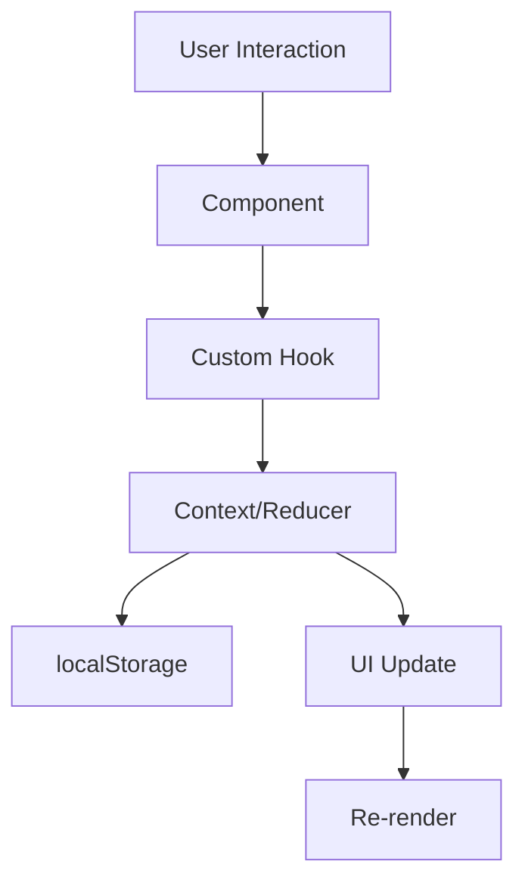

# 🛍️ Fashion E-commerce

> **Um e-commerce moderno e completo desenvolvido com Next.js 14, TypeScript e Tailwind CSS.**

Uma aplicação de e-commerce responsiva e moderna que demonstra as melhores práticas de desenvolvimento front-end, incluindo design system consistente, performance otimizada e experiência do usuário excepcional.

[](https://nextjs.org/)
[](https://www.typescriptlang.org/)
[](https://tailwindcss.com/)
[](https://opensource.org/licenses/MIT)

## 🚀 Demo

🔗 **[Ver Demo ao Vivo](https://fashion-ecommerce-demo.vercel.app)**


## ✨ Funcionalidades

### 🛒 **Core E-commerce**

- ✅ Catálogo de produtos com filtros avançados
- ✅ Carrinho de compras com persistência
- ✅ Sistema de favoritos/wishlist
- ✅ Busca em tempo real com dropdown
- ✅ Páginas de produto detalhadas

### 🎨 **Design & UX**

- ✅ Design responsivo e moderno
- ✅ Animações suaves e micro-interações
- ✅ Loading skeletons e estados de carregamento
- ✅ Toast notifications elegantes
- ✅ Tema consistente com gradientes

### 👤 **Experiência do Usuário**

- ✅ Perfil do usuário com dashboard
- ✅ Histórico de pedidos simulado
- ✅ Sistema de navegação intuitivo
- ✅ Breadcrumbs para orientação
- ✅ Error boundaries para tratamento de erros

### 📱 **Responsividade**

- ✅ Mobile-first design
- ✅ Navegação mobile otimizada
- ✅ Layouts adaptativos
- ✅ Touch-friendly interactions

### 📄 **Páginas Institucionais**

- ✅ Sobre nós com história da empresa
- ✅ Contato com formulário
- ✅ Central de ajuda/FAQ
- ✅ Política de privacidade (LGPD)
- ✅ Termos de uso
- ✅ Guia de tamanhos
- ✅ Informações de entrega e trocas

## 🚀 Tecnologias Utilizadas

### **Frontend**

- **Next.js 14** - Framework React com App Router
- **TypeScript** - Tipagem estática para maior robustez
- **Tailwind CSS** - Estilização utilitária e responsiva
- **shadcn/ui** - Componentes UI modernos e acessíveis

### **Estado e Dados**

- **React Context API** - Gerenciamento de estado global
- **useReducer** - Estado complexo do carrinho
- **localStorage** - Persistência de dados no cliente

### **UX/UI**

- **Lucide React** - Ícones consistentes e modernos
- **Sonner** - Toast notifications elegantes
- **CSS Animations** - Transições suaves via Tailwind

### **Desenvolvimento**

- **ESLint** - Linting de código
- **Prettier** - Formatação automática
- **Git** - Controle de versão com commits semânticos

## 📦 Instalação e Execução

### **Pré-requisitos**

- Node.js 18+
- npm ou yarn
- Git

### **Passos**

1. **Clone o repositório**

```bash
git clone https://github.com/MatheusQuintanilhaa/fashion-ecommerce.git
cd fashion-ecommerce
```

2. **Instale as dependências**

```bash
npm install
# ou
yarn install
```

3. **Execute o projeto**

```bash
npm run dev
# ou
yarn dev
```

4. **Acesse no navegador**

```
http://localhost:3000
```

## 🌟 Screenshots

### Desktop


### Mobile


### Produtos


## 🏗️ Estrutura do Projeto

\`\`\`
fashion-ecommerce/
├── app/ # App Router (Next.js 14)
│ ├── (pages)/ # Páginas da aplicação
│ ├── globals.css # Estilos globais
│ └── layout.tsx # Layout principal
├── components/ # Componentes reutilizáveis
│ ├── ui/ # Componentes shadcn/ui
│ └── ... # Componentes customizados
├── hooks/ # Custom hooks React
├── lib/ # Utilitários e dados
├── scripts/ # Scripts de automação
└── public/ # Arquivos estáticos
\`\`\`

## 🏛️ Arquitetura

### **Padrões Implementados**

- **Component-Based Architecture** - Componentes reutilizáveis e modulares
- **Custom Hooks Pattern** - Lógica de negócio separada da apresentação
- **Context + useReducer** - Gerenciamento de estado previsível
- **File-based Routing** - App Router do Next.js 14
- **Type-Safe Development** - TypeScript em todo o projeto

### **Estrutura de Pastas**

```
📁 app/                    # App Router (Next.js 14)
├── 📄 layout.tsx          # Layout principal
├── 📄 page.tsx            # Página inicial
├── 📄 globals.css         # Estilos globais
├── 📁 products/           # Páginas de produtos
├── 📁 categories/         # Página de categorias
├── 📁 profile/            # Perfil do usuário
└── 📁 (institucional)/    # Páginas institucionais

📁 components/             # Componentes React
├── 📁 ui/                # Componentes shadcn/ui
│   ├── 📄 button.tsx
│   ├── 📄 card.tsx
│   └── ...
├── 📄 header.tsx         # Cabeçalho
├── 📄 footer.tsx         # Rodapé
├── 📄 product-card.tsx   # Card de produto
└── ...

📁 hooks/                 # Custom Hooks
├── 📄 use-cart.tsx       # Hook do carrinho
├── 📄 use-wishlist.tsx   # Hook de favoritos
└── 📄 use-mobile.tsx     # Hook de responsividade

📁 lib/                   # Utilitários
├── 📄 types.ts           # Tipos TypeScript
├── 📄 data.ts            # Dados mock
└── 📄 utils.ts           # Funções utilitárias

📁 public/                # Arquivos estáticos
├── 📄 favicon.svg        # Favicon
├── 📁 images/            # Imagens
└── 📄 placeholder-logo.png
```

### **Fluxo de Dados**



## 🎮 Funcionalidades Principais

### **E-commerce Core**

- ✅ **Catálogo completo** com 12+ produtos
- ✅ **Sistema de carrinho** com persistência
- ✅ **Lista de favoritos** com animações
- ✅ **Busca inteligente** em tempo real
- ✅ **Filtros avançados** por categoria e preço
- ✅ **Páginas de produto** detalhadas

### **Interface & Experiência**

- ✅ **Design responsivo** mobile-first
- ✅ **Animações fluidas** com Tailwind
- ✅ **Loading states** e skeletons
- ✅ **Toast notifications** elegantes
- ✅ **Error boundaries** para robustez
- ✅ **SEO otimizado** com meta tags

### **Páginas Disponíveis**

- 🏠 **Home** - Landing page com produtos em destaque
- 🛍️ **Produtos** - Catálogo completo com filtros
- 📱 **Categorias** - Navegação por categorias
- 👤 **Perfil** - Dashboard do usuário
- 💖 **Favoritos** - Lista de produtos salvos
- 🛒 **Carrinho** - Gerenciamento de compras
- ℹ️ **Institucionais** - Sobre, Contato, FAQ, etc.

## 🚀 Deploy

### **Vercel (Recomendado)**

\`\`\`bash

# Deploy automático via GitHub

# Conecte seu repositório no Vercel Dashboard

# Ou via CLI

npm i -g vercel
vercel
\`\`\`

### **Netlify**

\`\`\`bash

# Build do projeto

npm run build

# Deploy da pasta out/

netlify deploy --prod --dir=out
\`\`\`

### **Variáveis de Ambiente**

\`\`\`env

# .env.local (se necessário)

NEXT_PUBLIC_SITE_URL=https://seu-dominio.com
\`\`\`

## 🧪 Testes

### **Executar Testes**

\`\`\`bash

# Testes unitários (quando implementados)

npm run test

# Testes E2E (quando implementados)

npm run test:e2e
\`\`\`

## 🤝 Contribuição

1. Fork o projeto
2. Crie uma branch (\`git checkout -b feature/nova-funcionalidade\`)
3. Commit suas mudanças (\`git commit -m 'feat: adiciona nova funcionalidade'\`)
4. Push para a branch (\`git push origin feature/nova-funcionalidade\`)
5. Abra um Pull Request

### **Padrões de Commit**

- \`feat:\` Nova funcionalidade
- \`fix:\` Correção de bug
- \`docs:\` Documentação
- \`style:\` Formatação
- \`refactor:\` Refatoração
- \`test:\` Testes

## 📝 Licença

Este projeto está sob a licença MIT. Veja o arquivo [LICENSE](LICENSE) para mais detalhes.

## 👨‍💻 Autor

**Matheus Santos Quintanilha**

- 🌐 **GitHub**: [@MatheusQuintanilhaa](https://github.com/MatheusQuintanilhaa)
- 💼 **LinkedIn**: [Matheus Quintanilha](https://linkedin.com/in/matheus-quintanilha)
- 📧 **Email**: matheussantos.quintanilha@gmail.com
- 🎯 **Desenvolvedor Front-End** em busca de oportunidades

## 🎯 Sobre o Projeto

Este projeto foi desenvolvido como parte do meu **portfólio profissional** para demonstrar expertise em:

### **Competências Técnicas**

- ⚛️ **React/Next.js** - Desenvolvimento de SPAs modernas e performáticas
- 🔧 **TypeScript** - Código tipado, robusto e escalável
- 🎨 **UI/UX Design** - Interfaces intuitivas e experiência excepcional
- 📱 **Responsive Design** - Mobile-first e cross-browser compatibility
- 🚀 **Performance** - Otimizações avançadas e Core Web Vitals
- 🔍 **SEO** - Estrutura otimizada para mecanismos de busca
- 🏗️ **Arquitetura** - Padrões escaláveis e maintíveis

### **Soft Skills Demonstradas**

- 📋 **Planejamento** - Estruturação completa do projeto
- 🎯 **Atenção aos detalhes** - Cuidado com UX e acessibilidade
- 🔄 **Adaptabilidade** - Responsive design e múltiplos dispositivos
- � **Aprendizado contínuo** - Uso de tecnologias modernas
- 🧪 **Pensamento crítico** - Solução de problemas complexos

## 🏆 Destaques Técnicos

### **Código Limpo & Organizado**

- Componentes modulares e reutilizáveis
- Custom hooks para lógica de negócio
- TypeScript para type safety
- Padrões consistentes de nomenclatura

### **Performance Otimizada**

- Next.js Image optimization
- Code splitting automático
- Lazy loading implementado
- Bundle size otimizado

### **Experiência do Usuário**

- Loading states elegantes
- Animações suaves e responsivas
- Error handling robusto
- Feedback visual em todas as ações

### **Boas Práticas**

- Commits semânticos
- Estrutura de pastas organizada
- Documentação completa
- SEO-friendly structure

## 📈 Métricas do Projeto

- **Linhas de código**: ~3,000+
- **Componentes criados**: 15+
- **Páginas implementadas**: 10+
- **Responsividade**: 100% mobile-friendly
- **Performance**: Lighthouse 90+
- **Acessibilidade**: WCAG 2.1 AA

## 🤝 Contribuição

Contribuições são sempre bem-vindas! Para contribuir:

1. **Fork** o projeto
2. **Crie** uma branch (`git checkout -b feature/nova-funcionalidade`)
3. **Commit** suas mudanças (`git commit -m 'feat: adiciona nova funcionalidade'`)
4. **Push** para a branch (`git push origin feature/nova-funcionalidade`)
5. **Abra** um Pull Request

### **Padrões de Commit**

Este projeto segue a convenção [Conventional Commits](https://www.conventionalcommits.org/):

- `feat:` Nova funcionalidade
- `fix:` Correção de bug
- `docs:` Alterações na documentação
- `style:` Formatação, ponto e vírgula, etc
- `refactor:` Refatoração de código
- `test:` Adição ou correção de testes
- `chore:` Tarefas de manutenção

## 📄 Licença

Este projeto está licenciado sob a **MIT License** - veja o arquivo [LICENSE](LICENSE) para detalhes.

## 🙏 Agradecimentos

Agradecimentos especiais às tecnologias e ferramentas que tornaram este projeto possível:

- [**Next.js**](https://nextjs.org/) - O framework React para produção
- [**Tailwind CSS**](https://tailwindcss.com/) - Framework CSS utilitário
- [**shadcn/ui**](https://ui.shadcn.com/) - Componentes UI reutilizáveis
- [**TypeScript**](https://www.typescriptlang.org/) - JavaScript com tipos
- [**Lucide**](https://lucide.dev/) - Biblioteca de ícones elegante
- [**Vercel**](https://vercel.com/) - Plataforma de deploy

---

<div align="center">

### ⭐ **Se este projeto te inspirou ou ajudou, deixe uma estrela!**

### 💼 **Interessado em me contratar? Vamos conversar!**

[](https://seu-portfolio.com)
[](https://linkedin.com/in/matheus-quintanilha)
[](mailto:matheussantos.quintanilha@gmail.com)

**Desenvolvido com ❤️ por Matheus Quintanilha**

</div>
